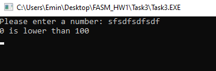

# FASM_HW1
Асатрян Эмин БПИ198
# Task 1
Программа, которая выводит Hello World!

# Task 2
Программа, которая производит арифметические вычисления
1) Сложение 5 + 10

2) Деление 15 на 12

3) Ввод некорректной арифметической операции

4) Деление на ноль (программа аварийно завершилась)

5) Ввод некорректного первого числа

6) Ввод некорректного второго числа

# Task 3
Программа, которая сравнивает введеное число с числом 100
1) Ввод числа >= 100

2) Ввод числа < 100

3) Ввод некорректного числа

# Task 4
Программа, которая считает факториал введенного числа
1) Ввод положительного числа

2) Ввод нуля (программа аварийно завершилась)

3) Ввод отрицательного числа (программа аварийно завершилась)

4) Ввод некорректного числа (программа аварийно завершилась)

# Task 5
Программа, определяющая, является ли введенное число простым
1) Ввод простого положительного числа

2) Ввод составного положительного числа

3) Ввод нуля

4) Ввод единицы

5) Ввод простого отрицательного числа

6) Ввод некорректного числа

